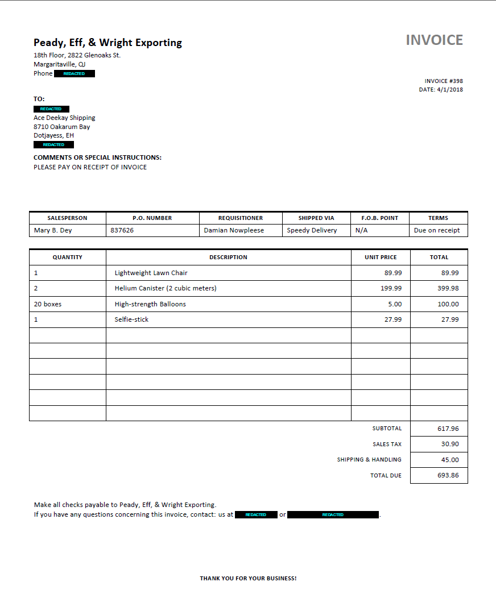

# Apryse Server SDK - Text Search and Redact sample

The [Apryse Server SDK](https://docs.apryse.com/core/guides/get-started) is a robust document library that is part of the part of the [Apryse SDK](https://apryse.com). It empowers server and desktop applications with accurate, reliable, and lightning-fast document processing capabilities.

- [Server SDK Guides](https://docs.apryse.com/core/guides)

This repo is designed to show how to use the [TextSearch](https://sdk.apryse.com/api/PDFTronSDK/java/com/pdftron/pdf/TextSearch.html) class to select specific text from an input document using Regular Expression patterns and perform redaction on them.

## Get your trial key

A license key is required to run WebViewer. You can obtain a trial key in our [get started guides](https://docs.apryse.com/core/guides), or by signing-up on our [developer portal](https://dev.apryse.com/).

## Install
```
git clone https://github.com/ApryseSDK/text-search-and-redact.git
```

## Build and Run

Open the project in the preferred IDE (e.g. Visual Studio) and build and run the project after completing the setup above.

The console application will run. The input documents from `TestFiles/Input` will be processed to find the specified `SearchItems` list of plain text and Regular Expression patterns:

```c#
// Search items and patterns to be redacted
List<SearchItem> searchItems =
[
    // Plain text
    new SearchItem(SearchItemType.Text, "Harry Styles"),
    // Regular expressions (RegEx)
    new SearchItem(SearchItemType.RegEx, @"\b(?:\+?1[-.\s]?)*\(?\d{3}\)?[-.\s]?\d{3}[-.\s]?\d{4}\b"), // Phone numbers
    new SearchItem(SearchItemType.RegEx, @"\b[A-Za-z0-9._%+-]+@[A-Za-z0-9.-]+\.[A-Za-z]{2,6}\b"), // Email addresses
    new SearchItem(SearchItemType.RegEx, @"\b(?:\d[ -]*?){13,16}\b"), // Credit card numbers
];
```

The code in this sample uses three overloads from `SearchAndRedactHelper.cs`:
- `SearchAndRedact(string sourcePath, string targetPath, IList<SearchItem> searchItems)` redacts the text by removing the text content and adding black redaction boxes
- `SearchAndRedact(string sourcePath, string targetPath, IList<SearchItem> searchItems, string overlayText)` redacts the text as above but also overlays custom text over the redaction boxes according to a predefined style
- ` public static void SearchAndRedact(string sourcePath, string targetPath, IList<SearchItem> searchItems, string overlayText, Redactor.Appearance appearance)` redacts the text as above but also overlays custom text over the redaction boxes according to a custom appearance

Once found, the text will be redacted and the output files will be generated in `TestFiles/Output`.


Sample output of Search and Redaction
